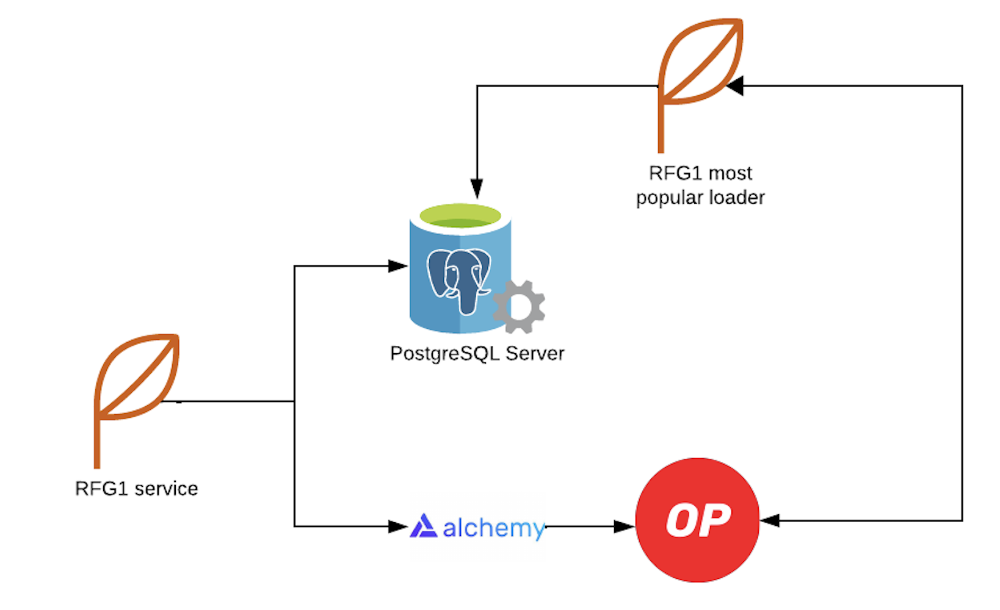
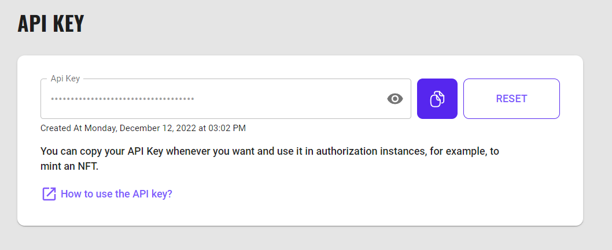

# RFG1 - Optimism Grants Council - WakeUp Labs

Welcome to WakeUp Labs' implementation of RFG1 from the Optimism Grants Council! Our service allows you to query the blockchain for specific past moments. Here's how you can get started:

## Introduction

Learn more about **WakeUp Labs** [here](https://www.wakeuplabs.io/) and explore our implementation of the Optimism **Request For Grants #1** [RFG1](https://app.charmverse.io/op-grants/page-8928491436774362) from the Optimism Grants Council. Our service is fully open-source with an MIT license.

## How to run

### Local Setup Guide

### Prerequisites
- Node.js installed on your machine
- Git installed for cloning the repository
- PostgreSQL installed and running or any database deployed

### Steps to Run Locally
  1. Clone the repository:
```bash
 git clone https://github.com/WakeUpLabs/RFG1-Optimism-Project.git
```

  2. Complete the environment variables in a ```.env``` file

  ```
    URL=
    PORT=
    RPC_TESTNET_URL=
    RPC_MAINNET_URL=
    DATABASE_URL=
  ```
  - URL: The base URL for the application. If you want to run it locally, it will be set to http://localhost.
  - PORT: Specifies the port number on which the server will listen for incoming requests.
  - RPC_URL: Refers to the Remote Procedure Call (RPC) endpoint for connecting to the Optimism blockchain. This variable is crucial for interacting with the blockchain, fetching data, or executing transactions.
  - PRIVATE_KEY: Represents the private key used for authentication or signing transactions. Ensure that this key is kept confidential and not shared publicly.
  - DATABASE_URL: Specifies the URL for connecting to the PostgreSQL database.

3. Run database migrations:
```bash
 npm run migrate
```
4. Install dependencies:

```bash
 npm install
``` 

5. Start the local server:

```bash
 npm run start
``` 


## Our architecture

Our service is purpose-built for effortless integration, streamlined maintenance, and adaptable extensibility with external services. Leveraging AWS infrastructure, we've deployed these services to create a scalable and high-performing solution.



As illustrated in the previous image, we have a dedicated service interfacing with the database. Its main goal is to load a roster of well-known contracts. This approach offers flexibility not only for the current solution but also for future implementations, supporting a custom and different sets of contracts that may pique interest.

## Try It Out

You can access the source code for this project on our GitHub repository: [WakeUpLabs/RFG1-Optimism-Project](https://github.com/WakeUpLabs/RFG1-Optimism.git). Additionally, we provide a comprehensive step-by-step guide to help you run the code locally or set it up as a service.

For your convenience, WakeUp Labs offers an easier solution by providing a deployed version that is ready to use and seamlessly integrates with your services. To get started, simply log in to our platform and obtain your unique apikey. This streamlined process ensures a quick and efficient integration into your workflow.

### Platform integration
---
#### Sign Up & Get Free Api Key

To use our services, you need to [sign up](https://platform.wakeuplabs.io/) and create a free API key with your email account. 

Once you have completed the registration process, go to the API Key section to view your API key information. 



Copy the generated API key and keep it safe, as it will be your credential for accessing our services 🔐


### Demo: Stoplight 

---

You can explore our service's capabilities through these demo endpoints:

#### Healthcheck Endpoint
- **Description:** Check the health status of the service.
- **Demo URL:** [Healthcheck Endpoint Demo](rfg1.json/paths/~1info/get)

#### Retrieve Wallet Balance
- **Description:** Retrieve the balance of a wallet.
- **Demo URL:** [Retrieve Wallet Balance Demo](rfg1.json/paths/~1{address}~1balance/get)

#### Retrieve Wallet Balance at Block
- **Description:** Get the wallet balance at a specific block.
- **Demo URL:** [Retrieve Wallet Balance at Block Demo](rfg1.json/paths/~1{address}~1balance~1block~1{blockNumber}/get)

#### Retrieve Wallet Balance at Date
- **Description:** Fetch the wallet balance at a specific date.
- **Demo URL:** [Retrieve Wallet Balance at Date Demo](rfg1.json/paths/~1{address}~1balance~1block~1{blockNumber}/get)

#### Get View Functions of Known Contracts
- **Description:** List view functions of known contracts.
- **Demo URL:** [View Functions of Known Contracts Demo](rfg1.json/paths/~1{address}~1functionsKnownABI/get)

#### Execute Contract Function
- **Description:** Execute a contract function.
- **Demo URL:** [Execute Contract Function Demo](rfg1.json/paths/~1{address}~1query/put)

#### Execute Known Contract Function
- **Description:** Execute a function of a known contract.
- **Demo URL:** [Execute Known Contract Function Demo](rfg1.json/paths/~1{address}~1queryKnownABI/put)
